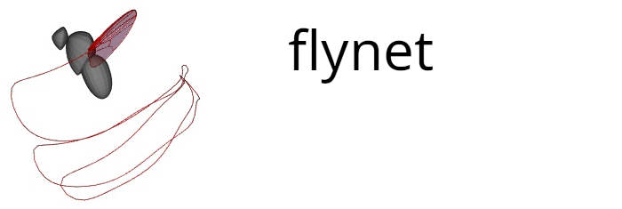

Flynet neural network and GUI application for automatically extracting wing
kinematics from movie sequences used in Melis, Siwanowicz, and Dickinson 2024.
Contains code for generating extended data figure 2.


### System Requirements

Tested on ubuntu 22.04 with Python 3.11.4

### Build Dependencies 

The following libraries are required in order to build the software. They
should be installed using apt prior to installing the software itself.  

```bash
sudo apt install qtbase5-dev libvtk9-dev libarmadillo-dev libboost-python-dev libboost-numpy-dev
```

### Dependencies
The complete list of software dependencies can be found in the "dependencies"
section of the pyproject.toml file. All of the dependencies, aside from the
build dependencies listed above,  will be automatically installed by the
Package Installer for Python (pip) when the software is installed.

### Installation
Requires a working installation of Python 3.11.4. To install cd into the source
directory and run
```bash
pip install .
```
The installation typically takes around 15-20min. 

### Running the flynet-app application

A set of example data for running the flynet GUI application are provided on
CaltechData (TODO add location).   

* Download the flynet.zip file from CaltechDATA, unzip the archive and place
  the resulting flynet_data directory in the user's home directory. 

* To start the flynet application run 'flynet-app' on the command line. 

### Training the flynet neural network

An example script, train_flynet.py,  demonstrating how the flynet neural
network is trained is provided in the 'examples' subdirectory.  A set of
example data for running the flynet GUI application are provided on CaltechData
(TODO add location).   

* Download the flynet.zip file from CaltechDATA, unzip the archive and place
  the resulting flynet_data directory in the user's home directory. 

* Run the train_fly.py script from within the 'examples' subdirectory.


